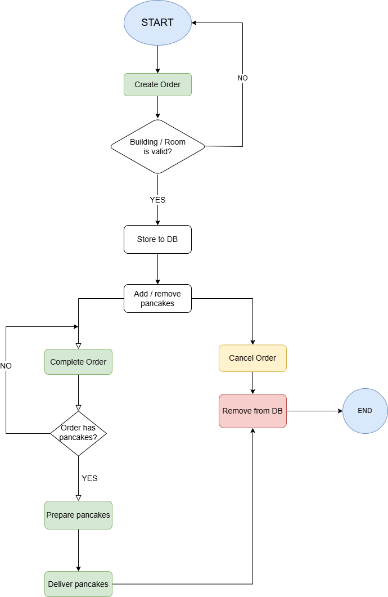

# Dojo Lab

## Description
Our Coding Dojo uses Pancake Lab, a pancake shop software solution for ordering pancakes.
The software solution can be used to order pancakes to the disciples' rooms and also
by the Sensei's Chef and Delivery service to prepare and deliver the pancakes.

### Use case
1. In the first step the Disciple creates an Order and specifies the building and the room number.
2. After that the Disciple can add pancakes from the menu.
3. The Disciple can choose to complete or cancel the Order, if cancelled the Order is removed from the database.
4. If the Disciple completes the Order the Chef can prepare the pancakes.
5. After the Chef prepares the Order it can be delivered.
6. After the Order is sent for delivery it is removed from the database.

## Problem statement
At first all was well but soon Disciples started to demand various kinds of pancakes that the application
didn't support or anyone could ever imagine.
The evil Dr. Fu Man Chu, the main Villain fighting the Sensei in an endless confrontation, took the chance
to bring havoc against his hated Dojo.
He hacked the system to add mustard with milk-chocolate and whipped cream pancake.
Some errors were also reported, disciples reported that pancakes were missing, delivery reported that they were
sent to a building that does not exist, etc.

## Assignment
The Sensei proposed that the application should be refactored. You, his best Disciple, have been tasked
to save the pancakes production in the Dojo.

The Sensei has put forth some conditions:
- the solution should be based on Object-oriented programming
- TDD should be followed
- a Design pattern should be used to avoid hardcoding recipes for pancakes and to allow disciples to choose the ingredients
- input data should be validated
- possible data-race issues should also be addressed
- documentation in the form of UML diagrams would be beneficial

Start now your assignment and save the Dojo.

---

The UML diagram flow:

